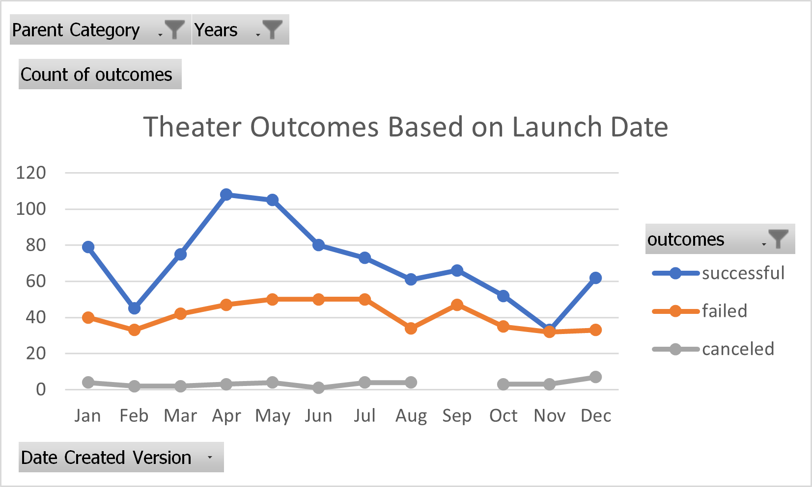
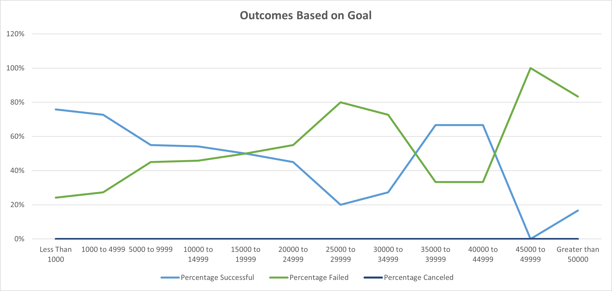

# Kickstarting with Excel

## Overview of Project
Louise is planning to launch a play called Fever.  She is close to her fundraising goal and would like statistical information  
to see the affect of launch dates and other plays available in a date set. The project will use excel tools to trend success and failures 
of theater projects based on launch dates and fundraising goals.

### Purpose
Provide information on success and failure rates for theater launch dates and fundraising goal rates for plays available from a date set.

## Analysis and Challenges
The Kickerstarter data set provided is unwiedy in size and information. There is information on over 4000 projects with over twenty data points.
The information provided is not limited to theater projects. The excel spreadsheet provides an opportunity to sort and filter the data into smaller 
bite sizes in order to comprehend the data.  Much of the data needs to be filtered and have calculations applied.

### Analysis of Outcomes Based on Launch Date
The most successfull theater launches by start dates from the raw numbers are between May and June. However, May and June also had the largest number of launch dates. 
The larger total number of plays launched during the time period of May to June contributes to the larger total number of outcomes for the months in general. 
A better way to view it would be by percentage of successful and failed plays based on the grand totoals for each month.

### Analysis of Outcomes Based on Goals
The outcomes of theater launches based on goals does not show a clear trend. Goals of less than $1000 had the highest percentage of success at 76%.  
Closely follwed by $1000 to $4999 at 73%. 
The success rates fluctuated and dipped as goals ranges increased, increasing again to 67% at the $35000 to $44999 range and then dropping off again.
Although it went up to 67%, the denominator was low for the $35000 to $44999 range, which could affect reliability.

### Challenges and Difficulties Encountered

Due to the size of the spreadsheet, pulling filtered data into and between spreadsheets was cumbersome. A clear vision of what data points needed to be pulled and 
analyzed specific to the purpose was dificult. The biggest difficulty I encounterd was the pivot table for Outcomes Based on Launch date. After confirming the totals were correct, 
I did not realize the total by month were off some.  This threw my chart off some. I used the demo table to accurately explain the outcomes. 

## Results
May and June had the highest number of successful launch dates. 
Less than $1000 had the highest percentage of success at 76%. 

- What are two conclusions you can draw about the Outcomes based on Launch Date?

From Outcomes based on Launch Date May had the highest number of successful launch dates.  
Conclusions that can be gleaned form this is that if Louise launhces her play in May, it is more likely to
have a successful outcome. If Louise launhces her play in December it will more likely not be successful.  Spring is probably the best time to launch.
  
- What can you conclude about the Outcomes based on Goals?

From the Outcomes based on Goals it was found that goals less than $1000 were most successful.  Although goals ranging from $35000  
to $44999 were relatively successful, the number of projects attempted was low, so it is less reliable predictor. Therefore, we can glean from this that 
a goal less than $1000 will more likely be successful.

- What are some limitations of this dataset?

Extraneous variables such as weather and environment was not available, which could have contributed to launch date success or failure.  
Extent of project financial needs and audience factors was not included that may have affected the 
success by fundraising goals. 

- What are some other possible tables and/or graphs that we could create?

Percntage could be added to the Outcomes Based on Launch Date pivot table.  Launch date could also have been looked at by year.  
A clustered column chart could have been used to display the Outcomes Based on Launch Date also. 
We could have looked at success or failure by country with a bar chart or Average dontations. We could have looked at plays specifically instead of theater in general.

